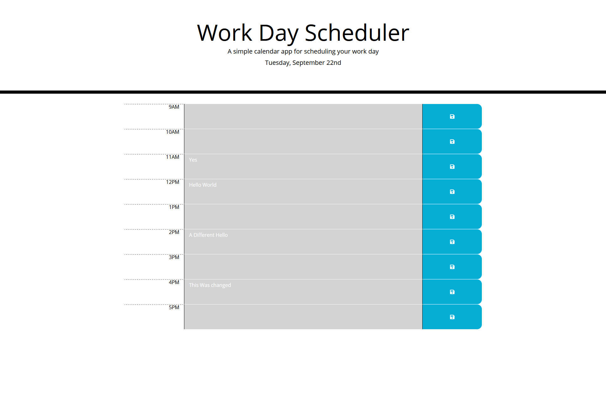

# Day-Planner
This is a very basic day planner made for my coding boot camp I'm currently enrolled in

## Function
It allows you to enter some text into one of the hour fields and save it local storage so that it can be recalled later as well as changing the colors of the hour fields based on the time of day. It shows the current day at the top as well.

